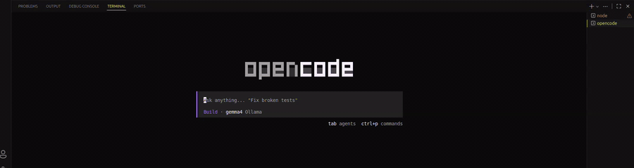

# BugMode 🐛

> Context Engineering Layer for AI Debugging

BugMode transforms raw errors and stack traces into AI-optimized debugging context for tools like Claude, Cursor, and Codex.

Instead of pasting cryptic errors into AI chats, BugMode analyzes your project structure, runtime, framework, and related files to generate precision-targeted debugging prompts automatically.

---

## 🎥 Demo

<p align="center">
  
</p>

> Select error → Generate context → Paste into AI → Get better fixes.

---

# Why BugMode Exists

AI coding assistants are powerful — but they fail when context is incomplete.

Raw stack traces lack:

* Project architecture
* Runtime details
* Related files
* Framework awareness
* Root cause hints

BugMode acts as a **context engineering layer** between your codebase and your AI assistant.

---

# ✨ Features

* 🧠 Smart error categorization
* ⚡ Runtime & framework detection
* 📁 Related file discovery
* 🏗 Project architecture awareness
* 🎯 AI-specific prompt optimization
* 🔒 Local-first (no telemetry / no API calls)
* 🧩 Model agnostic (Claude, Cursor, Codex, etc.)

---

# 🏗 Architecture

```txt
packages/
├── core-engine/     → Error analysis & categorization
├── parsers/         → Project context extraction
├── prompt-builder/  → AI-specific prompt generation
└── extension/       → VSCode integration
```

---

# 🔍 Example

## Input

```bash
TypeError: Cannot read properties of undefined (reading 'map')
```

## Generated Context

```txt
Framework: React
Runtime: Node.js 20
Probable Cause:
- API response shape mismatch
- Missing null guard before render

Related Files:
- src/components/UserList.tsx
- src/hooks/useUsers.ts

Suggested Fix Strategy:
1. Add optional chaining
2. Validate API response
3. Add loading fallback
```

---

# ⚡ Quick Start

```bash
pnpm install
pnpm build
```

Launch extension:

```bash
cd packages/extension
pnpm dev
```

Press `F5` inside VSCode.

---

# 🖥 VSCode Usage

1. Select an error or stack trace
2. Right click → `BugMode 🐛`
3. Choose target AI assistant
4. Prompt gets:

   * copied to clipboard
   * shown in side panel

---

# 📦 Commands

| Command                | Purpose                    |
| ---------------------- | -------------------------- |
| Generate for Claude    | Claude-optimized reasoning |
| Generate for Cursor    | Inline fix formatting      |
| Generate Debug Context | Generic AI prompt          |

---

# ⚙ Settings

| Setting                 | Default  |
| ----------------------- | -------- |
| `bugmode.defaultTarget` | `claude` |
| `bugmode.debugMode`     | `false`  |

---

# 🔒 Philosophy

BugMode is built around a few core principles:

* Local-first
* Fast deterministic analysis
* Zero telemetry
* Extensible architecture
* AI-tool independence

---

# 🛣 Roadmap

* [ ] AST-aware analysis
* [ ] Multi-error correlation
* [ ] Git-aware debugging context
* [ ] Terminal integration
* [ ] JetBrains extension
* [ ] AI-generated fix previews

---

# 🤝 Contributing

PRs, ideas, and feedback are welcome.

If you're interested in AI tooling, debugging systems, or developer experience engineering — contributions are highly appreciated.

---

# ⭐ Support

If BugMode helps you debug faster, consider starring the repo.
